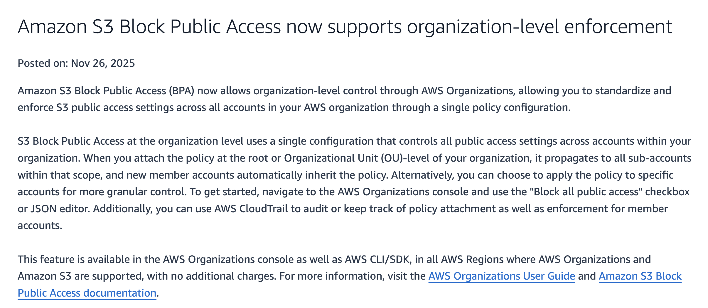
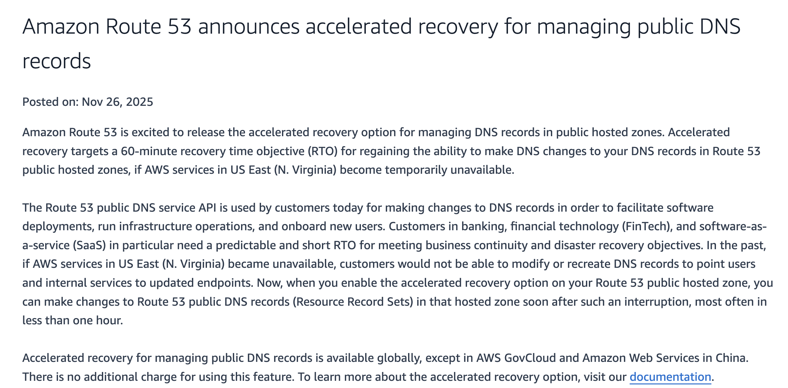
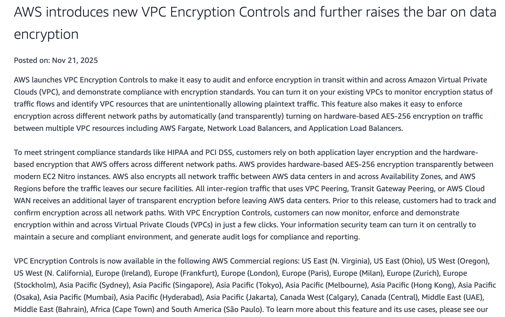
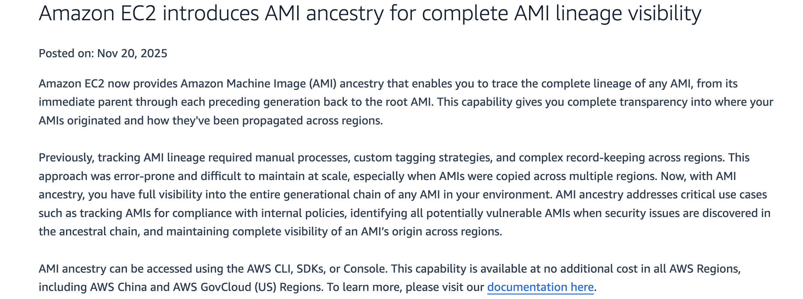
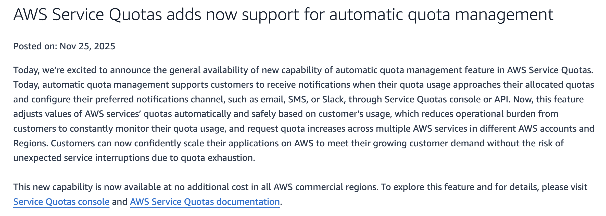

AWS ships fast. At AWS re:Invent 2025, AWS made 500+ announcements. Most teams don’t have time to read every release - but we did.

We did it for one reason: to stay on top of the technology (and help you do the same). Below is our shortlist of AWS updates worth adopting in 2026 if you want to stay ahead of the competition.

These updates help you lower the chance of security incidents, make audits less painful, and remove day-to-day operational friction. Here’s what you can do now to tighten security and compliance.

## 1) Stop accidental public S3 buckets across your whole AWS org

**What it is:** AWS lets you enforce "Block Public Access" for S3 at the organization level—so it applies across all your AWS accounts.

**Why it matters:** One wrong setting can expose data. This reduces the chance of "we didn't notice that bucket was public."

**Example:** You create a new AWS account for a new team. S3 public access is still blocked by default, without someone needing to remember to configure it.

**What to do:** Turn on org-level S3 Block Public Access for your production accounts (or the whole org) and treat it as a baseline security guardrail.

Source: [Amazon S3 Block Public Access organization-level enforcement](https://aws.amazon.com/about-aws/whats-new/2025/11/amazon-s3-block-public-access-organization-level-enforcement/)

## 2) Keep DNS changes available when AWS has a bad day

**What it is:** AWS added a Route 53 option that helps ensure you can still update your public DNS records during certain AWS service disruptions.

**Why it matters:** In an outage, changing DNS is often how you move users to a backup system. You don't want DNS updates to be unavailable when you need them most.

**Example:** Your main region has issues, and you need to send traffic to a standby region. This feature helps you keep the ability to make that DNS switch.

**What to do:** List the domains that are critical for your product (your website, API, login) and consider enabling this option for those zones first.

Source: [Amazon Route 53 accelerated recovery for managing public DNS records](https://aws.amazon.com/about-aws/whats-new/2025/11/amazon-route-53-accelerated-recovery-managing-public-dns-records/)

## 3) VPC Encryption Controls: prove your internal traffic is encrypted

**What it is:** AWS added a way to centrally check (and help enforce) that traffic inside your AWS network is encrypted when it moves between systems in your VPCs.

**Why it matters:** In regulated industries, auditors often ask: "Show us that data is encrypted while it's moving around internally." This makes that answer easier to produce and keep consistent over time.

**Example:** Your app runs in one network area (VPC) and your databases run in another. When you need audit evidence, you can point to a centralized control instead of collecting proof from each team.

**What to do:** List the most sensitive connections in your environment (app ↔ database, shared services, VPC-to-VPC traffic) and use this to standardize your "encryption in transit" posture.

Source: [AWS VPC encryption controls](https://aws.amazon.com/about-aws/whats-new/2025/11/aws-vpc-encryption-controls/)

## 4) AMI ancestry: see where your server images came from

**What it is:** AWS can now show what a server image (AMI) was created from.

**Why it matters:** When a base image has a security issue, you can quickly find which other images (and systems) might be affected.

**Example:** A vulnerability is found in an old base image. You can trace which AMIs were built from it and update them faster.

**What to do:** If your team builds custom AMIs, use this lineage info when you review and approve images for production.

Source: [EC2 AMI ancestry complete AMI lineage visibility](https://aws.amazon.com/about-aws/whats-new/2025/11/ec2-ami-ancestry-complete-ami-lineage-visibility/)

## 5) Automatic quota management: stop getting surprised by AWS limits

**What it is:** AWS can now watch certain service limits for you and automatically request higher limits when you're getting close.

**Why it matters:** Some outages happen for a boring reason: you simply hit a predefined AWS limit at the worst moment.

**Example:** Traffic grows and new servers can't start because you reached a limit. This feature helps reduce those "we didn't know there was a limit" situations.

**What to do:** Turn this on for the AWS services you scale often, and make sure the alerts go to the channel your team actually monitors.

Source: [Automatic quota management service quota management](https://aws.amazon.com/about-aws/whats-new/2025/11/automatic-quota-management-service-quota-management/)

---

Want more practical insights? Watch the full session: [AWS re:Invent 2025 Recap](https://www.youtube.com/live/-POnrk4phR0?si=-fHyip8UFiMmO3Ex)

And subscribe to our [newsletter](https://fivexl.io/#email-subscription) — we share practical security, compliance, and AWS updates to help you stay ahead of the curve.
