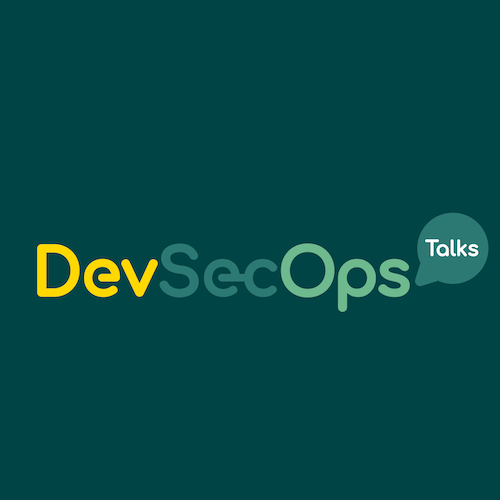
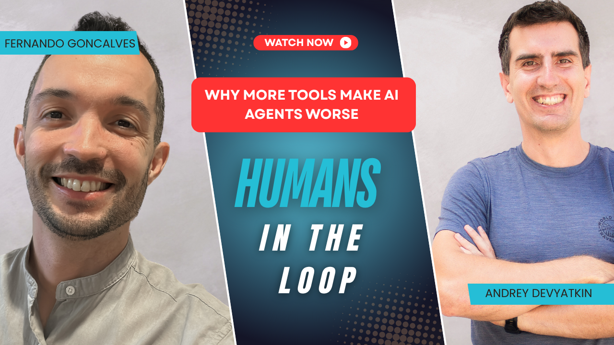

Greetings!

Here's what March looked like at FivexL: a webinar with Clearway Health's SVP of Technology on building audit-ready architecture, a major overhaul of our ECS alerting module, three new DevSecOps Talks episodes, and the launch of Humans in the Loop - a video series on agentic AI in DevOps born out of our work building [B.O.R.I.S.](https://getboris.ai/), an AI DevOps teammate at Sirob Technologies.

Beyond shipping, we're actively integrating AI into how we work - from delivery processes to internal tooling - and the team has been sharing and testing new tools along the way. Some of the best finds from our internal Slack made it into this edition's top articles below.

<!--more-->

## Events

Earlier this month we hosted a live session with Rusty Atkinson, Senior Vice President, Technology at Clearway Health. Together with [Andrey Devyatkin](https://fivexl.io/specialist/andrey-devyatkin/) and [Guilherme Ferreira](https://fivexl.io/specialist/guilherme-ferreira/), Rusty explored how leadership values translate into real security decisions and audit-ready architecture - the kind of conversation that connects culture to cloud config.

If you missed the live session:

- [Watch the full recording on YouTube](https://www.youtube.com/watch?v=CfVhr8j5yIA)
- [Read the 5 key takeaways](https://fivexl.io/blog/from-leadership-values-to-security/)

## Updates

### Open-source project updates

We keep a lot of the tooling we build for client work open source so you can plug it into your own environments. In March we shipped a major overhaul of our ECS alerting module and a dependency bump for lprobe.

#### terraform-aws-ecs-events-to-slack 1.0.3

Terraform module that captures ECS events via EventBridge and sends them to Slack - useful if you want real-time visibility into deployments, task failures, and cluster activity without building your own notification pipeline.

Major modernisation of the module. Lambda is now image-based (ECR) instead of ZIP, with Python 3.14 and two deployment modes (pre-built image or build from source). Skip `1.0.0`–`1.0.2` - they had a broken ECR replication path. Go straight to `1.0.3`.

If you're upgrading from `0.3.4`, the ZIP-to-image switch forces a Lambda recreation - use `terraform destroy -target` on the old function if the apply fails.

[See the full release notes](https://github.com/fivexl/terraform-aws-ecs-events-to-slack/releases/tag/1.0.3)

#### lprobe v0.1.9

A small CLI for running HTTP, TCP, and gRPC health checks against localhost inside container images - a secure alternative to shipping curl or wget in hardened containers. If you're running ECS or Docker workloads and want health checks without exposing download tools to attackers, this is what it's for.

This release is a dependency bump: gRPC updated from 1.78.0 to 1.79.3. No behaviour changes.

[See the release](https://github.com/fivexl/lprobe/releases/tag/v0.1.9)

### Blog post updates

- **[From Leadership Values to Security: Building Audit-Ready Architecture](https://fivexl.io/blog/from-leadership-values-to-security/)**
  A write-up of our March webinar with Rusty Atkinson. Covers how leadership principles shape security posture, and how to turn those principles into practical architecture choices your team can actually implement.

- **[FivexL Newsletter, February 2026](https://fivexl.io/blog/fivexl-newsletter-february-2026/)**
  Missed last month? The February edition covers two new case studies, open-source updates to CloudTrail-to-Slack and lprobe, and two podcast episodes on AI-in-dev and agent-native infrastructure.

### Podcast: DevSecOps Talks

Our co-founder [Andrey Devyatkin](https://fivexl.io/specialist/andrey-devyatkin/) hosts the DevSecOps Talks podcast together with Paulina Dubas and Mattias Hemmingsson. Paulina is an independent Lead DevOps Engineer/Architect who spent the last decade building and shaping cloud platforms. Mattias is a former CISO at a car rental company, a certified pentester, and a cloud engineering enthusiast. Together they use the show to sanity-check new trends, share what actually works in the field, and translate "DevSecOps" from buzzword back into day-to-day practice.

In March, they released three new episodes: a DevSecOps take on the key re:Invent 2025 announcements, a deep dive into AI dev loops with Paul Stack, and a conversation about platform engineering guardrails with Steve Wade.

#### Episode #93 – The DevSecOps Perspective: Key Takeaways From Re:Invent 2025

Andrey and Mattias go through the security announcements from re:Invent 2025 that actually matter for day-to-day work - VPC Encryption Controls, post-quantum TLS, organization-level S3 public access blocking, ECR image signing, JWT validation at ALB, and air-gapped AWS Backup. Worth a listen if you want the security angle on what AWS shipped at re:Invent.

[Listen the full episode](https://devsecops.fm/episodes/093-the-devsecops-perspective-key-takeaways-from-re-invent-2025/)

#### Episode #94 – Small Tasks, Big Wins: The AI Dev Loop at System Initiative

Paul Stack joins to talk about how AI-assisted development has evolved - from one-shot generation to agentic, human-in-the-loop workflows. The conversation covers plan mode, tight prompting, and how git branches and worktrees fit into the loop to keep things recoverable.

[Listen the full episode](https://podcasts.apple.com/es/podcast/94-small-tasks-big-wins-the-ai-dev-loop-at-system-initiative/id1503645730?i=1000754749681)

#### Episode #95 – From Platform Theater to Golden Guardrails with Steve Wade

Steve Wade joins to talk about "platform theater" - bloated Kubernetes setups that are hard to justify. He shares practical ways to spot it (hiring demands, onboarding time, the "acronym test") and what teams can cut or simplify in a 30-day deletion sprint.

[Listen the full episode](https://podcasts.apple.com/es/podcast/95-from-platform-theater-to-golden-guardrails-with/id1503645730?i=1000756878712)

## Humans in the Loop

Some of you know that FivexL is part of [Sirob Technologies](https://getboris.ai/) - an AI company building [B.O.R.I.S.](https://getboris.ai/), an AI DevOps teammate. BORIS plugs into your existing tools - AWS, GitHub, monitoring, logs - and helps with incident response, troubleshooting, infrastructure queries, and daily ops tasks. We invite you now to try it in a Slack playground.

Building an AI agent in production teaches you things that reading about AI agents doesn't. That hands-on experience is why [Fernando Goncalves](https://fivexl.io/specialist/fernando-goncalves/) and [Andrey Devyatkin](https://fivexl.io/specialist/andrey-devyatkin/) started **Humans in the Loop** - a video series where they talk honestly about agentic AI in DevOps: what works today, where it falls short, and how to work with it without losing control of your systems.

Two episodes are out:

- **[Agentic AI in DevOps Explained: Tools, Context, and What Changes Next](https://www.youtube.com/watch?v=ox1PmThs5II)**
  Fernando and Andrey set the foundation for the series. They cover what agentic AI actually means, why the ability to take action changes everything compared to a chatbot, why context is critical for infrastructure troubleshooting, and what tools like Cursor, MCP, Claude Code, Amazon Q CLI, and Kiro mean for DevOps engineers today. A good starting point if you're trying to understand where AI fits into DevOps beyond the hype.

- **[More Tools, Worse Results: Why Giving AI Agents More Tools Often Backfires](https://www.youtube.com/watch?v=USNEYoqew-U)**
  Giving an AI agent more tools sounds like an upgrade. In practice, it often does the opposite. This episode explores why more tools can mean more noise, more token waste, worse reasoning, and less reliable output - across Claude Code, Cursor, MCP setups, and agent workflows.

Want to see what BORIS can do? [Join the Slack playground](https://getboris.ai) and give it a spin - we'd love your feedback.

### Top 5 articles from the team

Here's what caught our team's attention this month - and why it might matter for you.

1. [Bucketsquatting is (Finally) Dead](https://onecloudplease.com/blog/bucketsquatting-is-finally-dead)

AWS introduced account regional namespaces for S3 general purpose buckets - a new naming scheme (`<prefix>-<accountid>-<region>-an`) that ties bucket names to your account and region, making bucketsquatting a thing of the past.

See also: [AWS announcement](https://aws.amazon.com/about-aws/whats-new/2026/03/amazon-s3-account-regional-namespaces/) | [AWS blog deep dive](https://aws.amazon.com/blogs/aws/introducing-account-regional-namespaces-for-amazon-s3-general-purpose-buckets/)

2. [Terraform AWS provider v6.34.0](https://github.com/hashicorp/terraform-provider-aws/releases/tag/v6.34.0)

Heads up for folks using `aws_s3_object`: starting with provider v6.34.0 the output format for `.id` changed. It now returns bucket + object key, not just the object key like before - so upgrading can break anything that assumes the old format. If you need the legacy behaviour, reference `.key` explicitly.

3. [IAM Roles Anywhere now supports post-quantum digital certificates](https://aws.amazon.com/about-aws/whats-new/2026/03/iam-roles-anywhere-post-quantum-digital-certificates/)

IAM Roles Anywhere now accepts ML-DSA-signed certificates - the NIST-standardised quantum-resistant signature algorithm. If you use Roles Anywhere to authenticate workloads running outside AWS, this lets you start migrating trust anchors to post-quantum crypto ahead of the curve.

4. [Claude Code for product managers: research, writing, context libraries, custom to-do system, more](https://www.youtube.com/watch?v=oBho3hZ7MHM&t=254s)

Not just for engineers. This walkthrough shows how product managers can use Claude Code for research, writing, context management, and building custom workflows - a good watch if you're curious about AI tooling beyond the terminal.

5. [I turned Obsidian into a co-working platform, and it's "our" notes now](https://www.xda-developers.com/obsidian-can-be-a-co-working-platform/)

A look at Relay, a collaboration plugin that brings real-time co-editing to Obsidian while keeping data local-first. Worth a read if your team uses Obsidian and you've been wishing for a privacy-friendly alternative to Google Docs for shared notes.

---

Made it till the end? Liked this newsletter? Forward it to a teammate or friend who lives in AWS as much as you do! Sharing is caring!