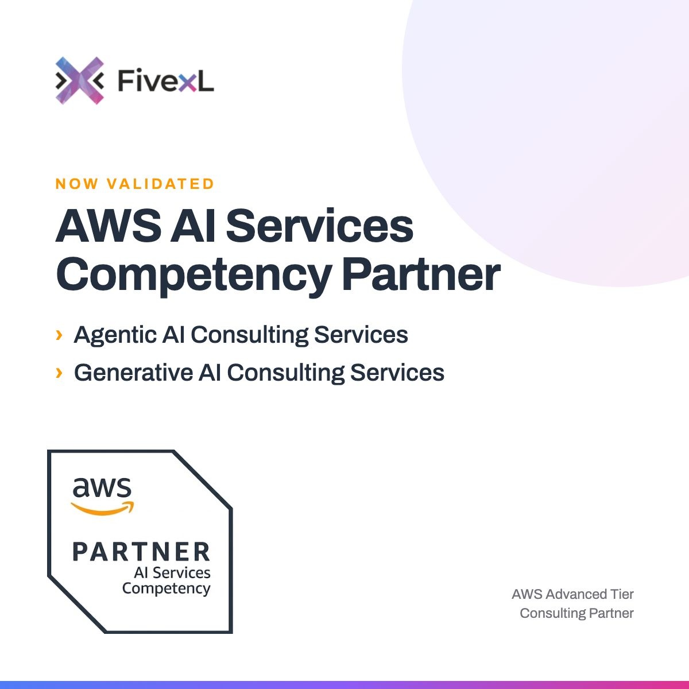

Greetings!

The FivexL newsletter is back after a summer break. While the newsletter was taking time off, the team kept shipping releases, writing posts and recording episodes through July and August, so this edition covers the whole summer rather than just September.

In this edition you'll find the news that FivexL earned the AWS AI Services Competency, a new release of our Terraform module that helps reduce AWS Config spend in Control Tower, and new SSO Elevator releases that add a command-line tool and let you control who can request which access.

There's plenty more besides, including releases for two more of our open-source modules, two new blog posts, six DevSecOps Talks episodes and three Agentic AI in DevOps episodes.

<!--more-->

## Events

Last weekend, [Vladimir Samoylov](https://fivexl.io/specialist/vladimir-samoylov/) presented at AWS Community Day Thailand. He talked about "Building Context Layer for AI Agents." We're proud of our teammates for getting out there, supporting the AWS community and sharing what we learn from real client work.

## Updates

### A new AWS competency

FivexL has earned the AWS AI Services Competency for Custom AI Agents Deployment on AWS Bedrock.

To get here, AWS reviewed our architecture, our security setup, and outcomes on real client engagements. It's a hard bar, and we're glad we cleared it.

If you're planning your first production Bedrock deployment, or fixing one that's giving your security team headaches, [let's talk](https://fivexl.io/contact/)!

### Open-source project updates

The tooling we build for client work stays open source, so you can run it in your own environments. Here are the highlights from July, August and September.

- **SSO Elevator** gives engineers temporary elevated access to AWS through IAM Identity Center and Slack, so nobody needs standing admin rights.
  - [4.3.0](https://github.com/fivexl/terraform-aws-sso-elevator/releases/tag/4.3.0) lets you control who can request access, not only who approves it, with the new `AllowedGroups` and `AllowedUsers` fields. Run `terraform apply` after upgrading to add the new Identity Store permission.
  - [4.4.0](https://github.com/fivexl/terraform-aws-sso-elevator/releases/tag/4.4.0) adds `elevator`, a command-line tool for submitting access requests, while approval still happens in Slack. It's off by default, and you can turn it on with `enable_access_requester_cli = true`.
  - [4.4.2](https://github.com/fivexl/terraform-aws-sso-elevator/releases/tag/4.4.2) fixes a self-approval bypass caused by case-sensitive email comparison, so it's worth upgrading.

- **[Control Tower Config Recorder v4.0.1](https://github.com/fivexl/terraform-aws-control-tower-config-recorder/releases/tag/v4.0.1)** lets you decide which resource types AWS Config records in your Control Tower accounts, how often, and in which accounts. The blog post below explains how it lowers your Config bill.

- **Account Baseline** applies baseline security settings to every account in your AWS organization.
  - [2.1.2](https://github.com/fivexl/terraform-aws-account-baseline/releases/tag/2.1.2) blocks public sharing of SSM documents.
  - [2.1.5](https://github.com/fivexl/terraform-aws-account-baseline/releases/tag/2.1.5) adds support for AWS Config daily recording mode.

- **CloudTrail to Slack** sends CloudTrail events to Slack so your team sees AWS API activity in real time.
  - [4.5.3](https://github.com/fivexl/terraform-aws-cloudtrail-to-slack/releases/tag/4.5.3) replaces `eval()` with a restricted rule evaluator and patches CVEs in its dependencies.

### Blog post updates

- **[How to Reduce AWS Config Costs in AWS Control Tower](https://fivexl.io/blog/reduce-aws-config-costs-control-tower/)**
  Control Tower puts AWS Config into continuous recording mode, so every ephemeral resource, like ENIs from restarting ECS tasks, gets recorded and billed. Since there's no way to change this in Control Tower today, the post introduces our open-source Terraform module that switches managed accounts to daily recording, lets you choose which resource types to track, and lets you opt accounts out.

- **[What to Consider When Migrating from AWS App Runner to Amazon ECS](https://fivexl.io/blog/aws-app-runner-deprecation-migrate-to-ecs/)**
  AWS is deprecating App Runner, and new customers were cut off on April 30. This post, published in July, covers what to plan for when you move your services to Amazon ECS, and it's worth reading if you're still running anything on App Runner.

- **[FivexL Newsletter, June 2026](https://fivexl.io/blog/fivexl-newsletter-june-2026/)**
  If you missed the last one, the June edition covers our AWS multi-account strategy guide, the "Starting on AWS the Right Way" session, releases for SSO Elevator, CloudTrail-to-Slack and ECS-events-to-Slack, and episodes #102 to #104 of DevSecOps Talks.

### Podcast: DevSecOps Talks

Our co-founder [Andrey Devyatkin](https://fivexl.io/specialist/andrey-devyatkin/) hosts the DevSecOps Talks podcast together with Paulina Dubas and Mattias Hemmingsson. Paulina is an independent Lead DevOps Engineer/Architect who spent the last decade building and shaping cloud platforms. Mattias is a former CISO at a car rental company, a certified pentester, and a cloud engineering enthusiast. Together they use the show to sanity-check new trends, share what actually works in the field, and translate "DevSecOps" from buzzword back into day-to-day practice.

Over the summer they released six episodes: four in July and two in September.

- **[Episode #106 - When Your Pet Project Tells You No](https://devsecops.fm/episodes/106-when-your-pet-project-tells-you-no/)**
  In this lighter summer episode, Andrey walks through the AI training coach he built from his own data, including Garmin activities pulled through Strava's API, body composition, VO2 max tests and blood work, all structured as JSON with sub-agents so the main session doesn't drown in context. His co-hosts point out the honest catch, which is that a generated plan still can't make you do the work.

- **[Episode #107 - Continuous Integration in 2026: What Still Matters](https://devsecops.fm/episodes/107-continuous-integration-in-2026-what-still-matters/)**
  Andrey and Paulina go back to why CI exists, from the nightly-build era at Ericsson to keeping the mainline permanently green, and talk about the trade-off between fast feedback and thorough testing. The new part for 2026 is an AI reviewer in GitHub Actions and a local coding agent that debate each other on the same pull request, although keeping changes small still matters most.

- **[Episode #108 - Assume You're Vulnerable: Security Beyond Patching](https://devsecops.fm/episodes/108-assume-you-re-vulnerable-security-beyond-patching/)**
  LLMs are driving a flood of dependency patches, and Andrey argues that you should stop treating clean code as safe, assume your software is already vulnerable, and architect so that a break-in finds nothing to work with, using minimal images, network segmentation and as little as possible facing the internet. The hosts also cover Dependabot's blind spot and why you should keep a human in the loop.

- **[Episode #109 - Docker Got Quiet. Did You Miss Anything?](https://devsecops.fm/episodes/109-docker-got-quiet-did-you-miss-anything-/)**
  Paulina and Andrey revisit Docker four years after their last episode on it and conclude that Docker lost production and now lives on as development tooling. The practical part of the episode is a rundown of the BuildKit and Buildx features worth knowing, from build secrets and `RUN --network=none` to SBOM and provenance attestations.

- **[Episode #110 - AWS Access Denied? Check Your Repo Rename](https://devsecops.fm/episodes/110-can-broken-github-actions-get-your-aws-account-blocked-/)**
  Since July 15, renaming or transferring a GitHub repository switches it to immutable OIDC subject claims, which can break IAM trust policies pinned to the old name, including org-wide wildcards. The episode covers how a stream of denied role assumptions from GitHub's runners can end with AWS blocking the account, how to answer an abuse notice, and how to migrate trust policies without an outage.

- **[Episode #111 - AI Agents: When Helpful Becomes Harmful](https://devsecops.fm/episodes/111-ai-agents-when-helpful-becomes-harmful/)**
  An agent with your credentials and a vague instruction can deploy a service nobody asked for. The hosts argue that what the session can reach matters more than how you word the prompt, walk through the July Hugging Face incident, and cover the EU AI Act and Cyber Resilience Act deadlines that have already passed.

## Agentic AI in DevOps

Some of FivexL members are part of [Sirob Technologies](https://www.linkedin.com/company/sirob-technologies/), building [B.O.R.I.S](https://getboris.ai) — an infrastructure context layer. AI agents lose your environment the moment a session ends. B.O.R.I.S keeps the context across AWS, GitHub, and Slack, so every answer starts from how your stack actually works.

Building an agent in production teaches you things you can't learn from reading about agents. That's why Fernando Goncalves, Andrey Devyatkin, and Vladimir Samoylov run live sessions to share what's actually happening when you run AI agents against real systems.

In September, B.O.R.I.S was one of the top three teams at [Tehnopol's AI Accelerator Demo Day](https://www.tehnopol.ee/en/ai-accelerator-top-three-teams-receive-grant/) and received a €10,000 grant.

Three episodes came out in September.

- **[Episode #18 - AI Writes Code. What's Your Job? with Julien Bisconti](https://www.youtube.com/watch?v=Z7BfkRguprI)**
  AI writes the code, yet engineers end the day buried in reviews and unsure what shipped. Andrey Devyatkin, Vladimir Samoylov and Fernando Gonçalves talk with Julien Bisconti about reference implementations, review stopping rules, why local agent transcripts can become an overlooked store of credentials, and why token spend alone can't measure an engineer's productivity.

- **[Episode #19 - AI Doom Can Wait. Your Security Alerts Can't](https://www.youtube.com/watch?v=qaLZ-9JS280)**
  LLMs can help sort the security alert queue, but useful triage depends on evidence, limited access and spending controls. Andrey and Fernando discuss GuardDuty findings, why `ReadOnlyAccess` can expose S3 objects and DynamoDB data, and why batch analysis of a week of alerts should come before unattended agents.

- **[Episode #20 - Become an Agentic Engineer with Kaido Koort](https://www.youtube.com/watch?v=fdmYZMhQKV4)**
  Claude Code can produce more code than an engineer can comfortably review. Andrey and Fernando join Kaido Koort to talk about agentic engineering training, validator sub-agents, session handoffs, and why verification and validation need separate gates for agent output.

Want to see what B.O.R.I.S can do? [Join the waiting list](https://www.getboris.ai/#waitlist) to try the free version, or [book a demo](https://www.getboris.ai/book-a-demo/).

## Top picks from the team

Here's what caught our attention in Slack this summer.

1. **[The next generation of AgentCore Runtime](https://docs.aws.amazon.com/bedrock-agentcore/latest/devguide/agents-tools-runtime.html)**
   AWS announced the next generation of AgentCore Runtime, the serverless microVM compute within Amazon Bedrock AgentCore. It reclaims unused memory throughout the session, so you pay for what your agent actually uses rather than its peak, and cold start times stay consistent regardless of container image size or concurrency.

2. **[Restrict AWS Management Console access to expected networks with sign-in resource-based policies and RCPs](https://aws.amazon.com/blogs/security/restrict-aws-management-console-access-to-expected-networks-with-sign-in-resource-based-policies-and-rcps/)**
   You can now use resource-based policies and resource control policies (RCPs) to allow console sign-in only from your corporate IP ranges or VPCs, with exceptions for principals you choose. It works for a single account or across your whole AWS Organization, and it's especially useful if you're in a regulated industry and need a consistent network perimeter.

3. **[New low-cost burstable Amazon EC2 T8i instances are generally available](https://aws.amazon.com/blogs/aws/new-low-cost-burstable-amazon-ec2-t8i-instances-are-generally-available/)**
   T8i is the new burstable instance family for workloads with low to moderate CPU use, such as microservices, development and staging environments, small databases and low-traffic websites. Compared with T3, AWS says you get up to 30% better price performance and up to 70% higher compute performance, in four sizes from nano to medium. If you still run a fleet of T3s, it's worth checking whether your region has T8i yet.

---

Made it till the end? Liked this newsletter? Forward it to a teammate or friend who lives in AWS as much as you do! Sharing is caring!
