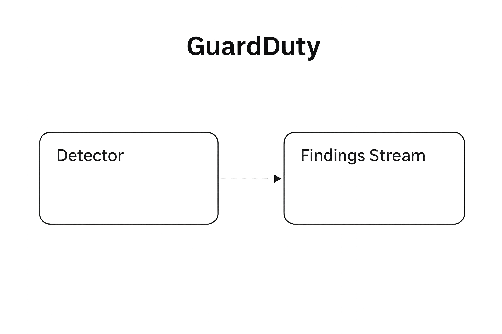

This Part-1 guide is for founders and small product teams shipping their first release on AWS without a full-time DevOps crew. In ~10 minutes you'll set a rock-solid foundation that stops the classic MVP disasters—surprise bills, insecure accounts, and zero audit trail. We walk you through:

- **Root hardening + MFA** and IAM admin/SSO
- Wire up **Budgets & Cost Anomaly Detection**
- Choose a **sane region** with real-world trade-offs (us-east-1 vs us-east-2, eu-central-1)
- Enable **CloudTrail and GuardDuty** (plus Slack alerts for instant signal)
- And—when you're ready—add **AWS Organizations** for a clean multi-account path

Read this first to ship faster today and avoid expensive fixes tomorrow.

## Step-by-step: the 10-minute AWS foundation

### 1) Lock down the root account (MFA + real contacts)

**Do this:**

- Add MFA to the root user (passkey/hardware key or TOTP).
- Ensure email & phone match billing and are accessible.

**Why:** root is "god mode", compromise = game over.

**Console path:**  
AWS Console → top-right account menu → Security credentials → Multi-factor authentication (MFA)

**Verify:** Try signing in as root—you should be prompted for MFA.

**Pitfalls:** Fake contact info can get accounts frozen during verification.

### 2) Create an admin you can actually use (IAM user or SSO)

**Do this:**

- Prefer **IAM Identity Center (SSO)** if you have an identity provider, think Google Workspace/Okta/Microsoft Entra.
- If you really really have to create an IAM admin user in an Admins group with `AdministratorAccess`. This is a bad practice, static IAM users have static credentials that give a long opportunity window for attackers if leaked. Always prefer IAM Identity Center since it gives you temporary credentials.
- Require MFA for that user.

**Why:** Stop using root; use short-lived or MFA-protected access.

**Console path:**

- **SSO:** IAM Identity Center → Enable → Connect IdP
- **IAM user:** IAM → Users → Create user → Add to group (Admins)

**Verify:** Sign out, log in as the admin user, confirm permissions.

**Pitfalls:** Don't create long-lived access keys unless necessary.

### 3) Set a budget + anomaly detection (before any deploy)

**Do this:**

- Create a **Monthly Cost Budget** (e.g., €500) with alerts at 85%, 100%, and 100% forecast.
- Enable **Cost Anomaly Detection** (account-level monitor).

**Why:** Catch spend spikes before they become invoices.

**Console path:**  
Billing → Budgets → Create budget and Billing → Cost Anomaly Detection

**Verify:** Trigger a tiny service (e.g., a t4g.nano for 10 minutes) and confirm the budget dashboard updates.

**Pitfalls:** Forgetting forecast alerts; routing alerts to a personal inbox no one checks. We recommend using shared inboxes like Google Groups so multiple people can be notified.

### 4) Pick a sane Region (us-east-1 vs us-east-2, eu-central-1)

**Do this:**

- Choose one primary Region based on users + service availability.
- **Defaults:** us-east-2 (calmer, 3 AZs), or eu-central-1 in EU.
- Use us-east-1 only if you need the newest services and accept occasional turbulence. [Read about the latest AWS outage here](https://aws.amazon.com/message/101925/?refid=649dc681-acce-453b-98f9-60db0009f901)

**Why:** Wrong Region = missing services + messy migration later.

**Console path:**  
Region selector at the top right of the console; also check Service Quotas and service availability pages.

**Verify:** Confirm chosen Region in the console header and note it in your runbook.

**Pitfalls:** Picking brand-new Regions where your required services aren't available.

### 5) Enable CloudTrail (audit trail)

**Do this:**

- Create a **management events trail** to a new S3 bucket.
- Add an S3 lifecycle rule (e.g., transition to Glacier after 90 days).

**Why:** Without an audit trail you can't answer "who changed what?"

**Console path:**  
CloudTrail → Trails → Create trail → Management events → New S3 bucket

**Verify:** Perform a simple action (e.g., list S3) and check Event history.

**Pitfalls:** Leaving logs forever in S3 without lifecycle (cost creep).

### 6) Turn on GuardDuty (turn key threat detection)

**Do this:**

- Enable **Amazon GuardDuty** (default detector).

**Why:** Catches suspicious activity (crypto-mining attempts, odd data patterns) early.

**Console path:**  
Security → GuardDuty → Enable

**Verify:** Use Sample Findings to test your alert pipeline (next step).

**Pitfalls:** Forgetting to wire notifications—detections you don't see are useless.

### 7) Pipe alerts to Slack (CloudTrail/GuardDuty/Cost Anomaly → AWS Chatbot)

**Do this:**

- Create/choose an SNS topic for security and budget alerts.
- Configure **AWS Chatbot** to post that SNS topic to a Slack channel.
- Add Budget & GuardDuty notifications to the topic.

**Why:** Alerts you actually see → incidents you actually fix.

**Console path:**

1. AWS Chatbot → Configure client → Slack → Configure channel → Notifications: add SNS
2. Then in Budgets & GuardDuty, set notifications to that SNS topic.

**Verify:** Use GuardDuty → Sample findings and confirm a Slack message lands.

**Pitfalls:** Alerts routed to personal email, silently ignored.

### 8) (Optional) Create an Organization (multi-account later)

**Do this:**

- Enable **AWS Organizations** and note planned accounts: sandbox, dev, prod, log-archive.

**Why:** Cleaner boundaries, easier audits/transfers, safer prod.

**Console path:**  
AWS Organizations → Create organization

**Verify:** Org is active; root email documented; a note exists in your runbook.

**Pitfalls:** Spinning accounts too early without naming/guardrail plans.

---

Before you spin up, compute or wire a database, lock in the guardrails that keep your MVP fast, safe, and cheap. This is the **minimum viable hygiene**—do it once, sleep better forever.

## 60-second pre-deploy audit (tick each one)

- ☐ Root MFA enabled
- ☐ Admin access via SSO/IAM (with MFA)
- ☐ Monthly budget set (alerts at 85% / 100% / 100% forecast)
- ☐ Cost Anomaly Detection enabled
- ☐ Primary Region chosen & documented
- ☐ CloudTrail → S3 (with lifecycle to archive)
- ☐ GuardDuty enabled
- ☐ Sample finding routed to Slack (SNS → AWS Chatbot → #alerts)
- ☐ (Optional) AWS Organization plan noted (prod / dev / log-archive)

---

## What's next?

Once the foundation is solid, the next bottleneck is choosing the right compute shape and a VPC that won't booby-trap your costs. Read our dedicated post — [**"Building MVP on AWS: Key Services and Benefits for Startups"**](/blog/mvp-on-aws/) — to explore what AWS services to choose for MVP.

---

## Ready-made accelerators

You've set up the basics—nice. If you'd rather not build everything else from scratch, we've got plug-and-play options to speed you up. Check out these ready-made accelerators that handle accounts, security, and deployment so you can focus on the product.

### FivexL RightStart

FivexL RightStart gives startups a ready-to-run AWS foundation—secure, scalable, and audit-ready—with multi-account setup, least-privilege access, centralized logging, and cost controls as code so you can ship faster, pass audits, and keep costs predictable.

[Learn more](/rightstart)

### FivexL's AWS ECS Blueprint

FivexL's AWS ECS Blueprint is a ready-to-run container platform on ECS/Fargate with automated CI/CD, autoscaling, private networking, least-privilege access, centralized logging, and audit-friendly defaults—so startups can ship fast, stay reliable, and meet HIPAA/SOC 2.

[Learn more](/ecs-blueprint)

### Infra Clinic for Startups

If you'd like a quick, expert sanity check before you scale, apply for the **Infra Clinic for Startups**. One startup each month receives a full 1-month Infra Clinic advisory, hands-on DevOps, and AI-powered support — for a symbolic donation to children's health. Every applicant gets a free discovery call.

[Apply and get your free consultation:](https://clinic.fivexl.io/)

---

## Watch the full setup guide

Watch this episode, where our team shows how to set everything up step by step:
 
 
<iframe width="560" height="315" src="https://www.youtube.com/embed/doZ680s5E1g?si=ORj0771sZDDclR2u" title="YouTube video player" frameborder="0" allow="accelerometer; autoplay; clipboard-write; encrypted-media; gyroscope; picture-in-picture; web-share" referrerpolicy="strict-origin-when-cross-origin" allowfullscreen></iframe>

