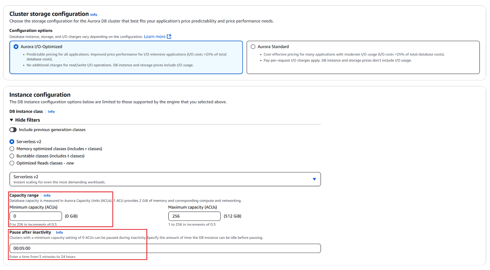
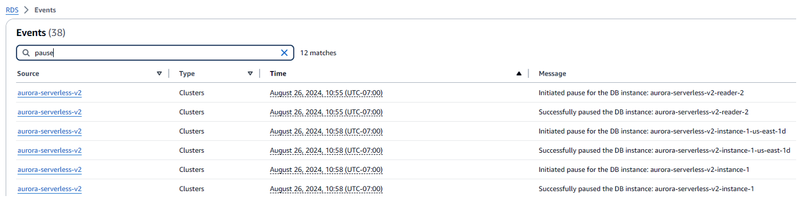

A lot of MVP teams pick PostgreSQL because it's familiar, powerful, and boring in the best way. Then they open the AWS console, click through defaults, and accidentally create a database that's hard to secure, annoying to operate, and painful to make audit-friendly later.

In our work with startups, this is one of the most common patterns: the product ships fast, the first customers arrive… and suddenly you need tighter security, better logging, sane network boundaries, and fewer "who created this?" mysteries.

## Aurora vs "Plain RDS Postgres"

If you don't know which variant of PostgreSQL to choose in AWS - Amazon Aurora PostgreSQL is your default choice.

### The key difference isn't "features" — it's how storage behaves

Aurora writes data to a cluster volume that's designed for high durability by replicating across multiple storage nodes across Availability Zones. AWS documents this as replication across six storage nodes across Availability Zones for the cluster volume. [AWS Documentation](https://docs.aws.amazon.com/AmazonRDS/latest/AuroraUserGuide/Aurora.Overview.StorageReliability.html)

Aurora storage also scales magically. Heard the classic "we're out of disk space" story? With Aurora, you'll usually never get that far — and if you do, you're probably already big enough to have someone whose job is to worry about it. Aurora storage grows automatically up to 128 TiB per cluster volume.

And if you later need multi-Region recovery patterns, Aurora Global Database lets you add secondary clusters in other Regions (AWS docs currently describe up to 10 secondary clusters, depending on configuration). [AWS Documentation](https://docs.aws.amazon.com/AmazonRDS/latest/AuroraUserGuide/aurora-global-database.html)

None of this removes the need for good architecture. It just reduces the number of early-stage footguns.

---

## Day-zero choices that save you future weekends

Here's the MVP mindset we recommend: make the database boring now, so you don't have to do heroics later.

### 1) Create custom parameter groups (cluster + instance)

Aurora PostgreSQL has parameters that apply at cluster level and others per instance — AWS explicitly calls this out. [AWS Documentation](https://docs.aws.amazon.com/AmazonRDS/latest/AuroraUserGuide/USER_WorkingWithDBClusterParamGroups.html) But don't overthink it. You can swap a parameter group later — it typically just requires a database reboot (often around 30 seconds).

**For Linux, macOS, or Unix:**

```bash
aws rds create-db-parameter-group \
    --db-parameter-group-name mydbparametergroup \
    --db-parameter-group-family aurora-postgresql17 \
    --description "My new parameter group"
```

**For Windows:**

```bash
aws rds create-db-parameter-group ^
    --db-parameter-group-name mydbparametergroup ^
    --db-parameter-group-family aurora-postgresql17 ^
    --description "My new parameter group"
```

### 2) Require SSL/TLS from day one

On PostgreSQL in RDS/Aurora, you should enforce encrypted connections by setting `rds.force_ssl=1`. AWS documents the setting and also notes that defaults differ by major version (for example, PostgreSQL 15+ commonly defaults to forcing SSL). [AWS Documentation](https://docs.aws.amazon.com/AmazonRDS/latest/UserGuide/PostgreSQL.Concepts.General.SSL.html)

### 3) Turn on slow query logging early

In MVP land, performance issues are usually self-inflicted: missing indexes, chatty ORM patterns, "it worked on SQLite" surprises.

Set `log_min_duration_statement` to something reasonable (often a few seconds) so slow queries show up in logs. Any SQL statement that runs at least for the specified amount of time or longer gets logged. By default, this parameter isn't set. Turning on this parameter can help you find unoptimized queries. AWS documents how `log_min_duration_statement` drives query logging. [AWS Documentation](https://docs.aws.amazon.com/AmazonRDS/latest/UserGuide/USER_LogAccess.Concepts.PostgreSQL.html)

### 4) Set a sane idle_in_transaction_session_timeout

Long "idle in transaction" sessions can quietly hold locks and pile up pain. AWS notes that defaults can be very large (commonly 24 hours) and recommends configuring the parameter to avoid ongoing idle-in-transaction issues.

### 5) Use managed password storage + rotation (and don't overuse the master user)

AWS supports managing the master password in AWS Secrets Manager for RDS/Aurora, including rotation flows. [AWS Documentation](https://docs.aws.amazon.com/AmazonRDS/latest/UserGuide/rds-secrets-manager.html) We typically treat the master user as "break glass" and create an app-specific role with minimum privileges.

### 6) Encrypt with a customer managed KMS key (especially if HIPAA / SOC 2 is on your horizon)

Aurora lets you choose the AWS managed key or a customer managed key for encryption. [AWS Documentation](https://docs.aws.amazon.com/AmazonRDS/latest/AuroraUserGuide/Overview.Encryption.html) The subtle gotcha: if you start with the default key and later need a different one (cross-account sharing, stricter policy control, compliance checks), you usually end up doing a snapshot copy / re-encrypt / restore style migration.

---

## Instance sizing for startups: tiny is fine, but be deliberate

The basic math is simple: if your database is idle most of the time (think ~90%), Aurora Serverless v2 is often a good fit. If the load is unpredictable and it directly drives revenue, run the numbers — and if you still can't predict it with confidence, Serverless v2 is a reasonable default. In most other cases, standard provisioned instances are typically much cheaper.

Aurora Serverless v2 is also an option when usage is spiky. As of late 2024, AWS added scaling to 0 capacity (auto-pause) when you configure minimum capacity to 0 ACUs, so dev environments can get genuinely cheaper when idle.

**Trade-off:** your "cheap when idle" plan can break if something holds connections open (tools, health checks, proxies). Treat it like a real system, not magic.





---

## Under the hood: A Terraform baseline for Aurora PostgreSQL ([code source 🙏](https://cageyv.dev/posts/aws-mvp-postgresql/))


Below is a compact example showing the main ideas: custom KMS key, parameter groups, Secrets Manager managed master password, IAM DB auth, private subnets, and locked-down security group.

```hcl
# Aurora PostgreSQL MVP baseline (simplified)

resource "aws_kms_key" "aurora" {
  description             = "Aurora CMK for MVP"
  deletion_window_in_days = 30
  enable_key_rotation     = true
}

resource "aws_rds_cluster_parameter_group" "aurora_pg_cluster" {
  name   = "mvp-aurora-pg-cluster"
  family = "aurora-postgresql16"

  parameter {
    name  = "rds.force_ssl"
    value = "1"
  }

  parameter {
    name  = "log_min_duration_statement"
    value = "5000" # ms: log queries slower than ~5s
  }

  parameter {
    name  = "idle_in_transaction_session_timeout"
    value = "300000" # ms: 5 minutes
  }

  # Requires reboot when changed
  parameter {
    name  = "shared_preload_libraries"
    value = "pg_stat_statements,pgaudit"
  }
}

resource "aws_db_parameter_group" "aurora_pg_instance" {
  name   = "mvp-aurora-pg-instance"
  family = "aurora-postgresql16"
}

resource "aws_rds_cluster" "mvp" {
  cluster_identifier = "mvp-transactions"
  engine             = "aurora-postgresql"
  engine_version     = "16.4"

  storage_encrypted = true
  kms_key_id        = aws_kms_key.aurora.arn

  manage_master_user_password = true
  master_username             = "pgroot" # used rarely; apps should use a separate role

  iam_database_authentication_enabled = true

  db_cluster_parameter_group_name  = aws_rds_cluster_parameter_group.aurora_pg_cluster.name
  db_instance_parameter_group_name = aws_db_parameter_group.aurora_pg_instance.name

  # networking bits omitted here: subnet group + SGs should point to private subnets
}

resource "aws_rds_cluster_instance" "writer" {
  identifier         = "mvp-transactions-writer-1"
  cluster_identifier = aws_rds_cluster.mvp.id
  instance_class     = "db.t4g.medium"
  engine             = aws_rds_cluster.mvp.engine
}
```

---

## A practical checklist before you click "Create database"

- ☐ SSL enforced (`rds.force_ssl=1`)
- ☐ Slow query logging enabled (`log_min_duration_statement`)
- ☐ Idle-in-transaction timeout set (avoid zombie transactions)
- ☐ Master password managed in Secrets Manager (rotation-ready)
- ☐ Customer managed KMS key chosen up front (migration later is annoying)
- ☐ Custom parameter groups created (cluster + instance)
- ☐ Private networking + tight security groups (boring is beautiful)

---

## What we learned (and what we keep repeating)

PostgreSQL itself is rarely the problem. Default choices are. In MVPs, we've seen the same movie too many times: the database ships fast, works fine for a few months, and then becomes the place where security, operability, and "who changed this?" questions go to breed.

The good news: you don't need a perfect design. You need a boring baseline that holds up when the product starts moving — and when you suddenly care about logs, encryption, access boundaries, and repeatability.

Here's what we keep pushing teams to do early:

- **Treat VPC choice like a one-way door.** Put the database in a custom VPC from day one.
- **Enforce SSL and enable basic observability** (slow query logging) before you're debugging a production incident at 2 a.m.
- **Use Secrets Manager-managed credentials** and keep the master user for "break glass" moments.
- **Pick customer managed KMS keys** especially if compliance (HIPAA / SOC 2) is anywhere on your roadmap.
- **Keep instance sizing pragmatic:** small and cheap when you can, Serverless v2 when idle/spiky usage genuinely makes sense.

---

## Liked the article?

Join our [**newsletter**](/#email-subscription) and we'll keep sharing the patterns that help MVP teams ship fast without creating a six-month cleanup project.

If you want a second pair of eyes before you ship, our [RightStart service](/rightstart) can help you set the AWS foundation correctly from day zero — and if your MVP is container-based, we can also get you running cleanly on Amazon Elastic Container Service (Amazon ECS) with our [ECS Blueprint](/ecs-blueprint) without turning your first release into a long-term maintenance tax.

---

## Related posts

This post is based on our YouTube episode about PostgreSQL on AWS (Aurora focus) and extends our MVP series. If you missed the earlier parts, start here:

- [**"How to Build an MVP on AWS (Part 1)"**](/blog/mvp-on-aws-part-1/) — Account Setup, Security & Cost Control
- [**"Building MVP on AWS: Key Services and Benefits for Startups"**](/blog/mvp-on-aws/) — Key Services and Benefits

