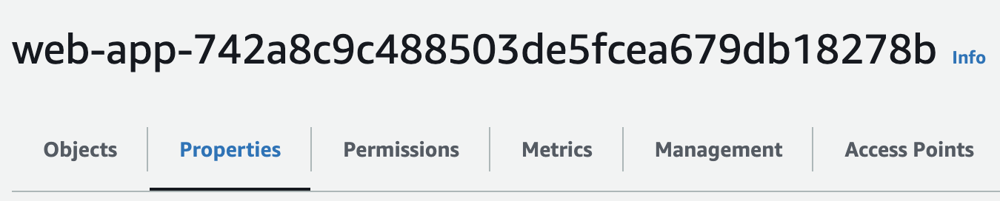
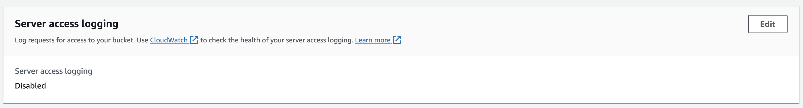
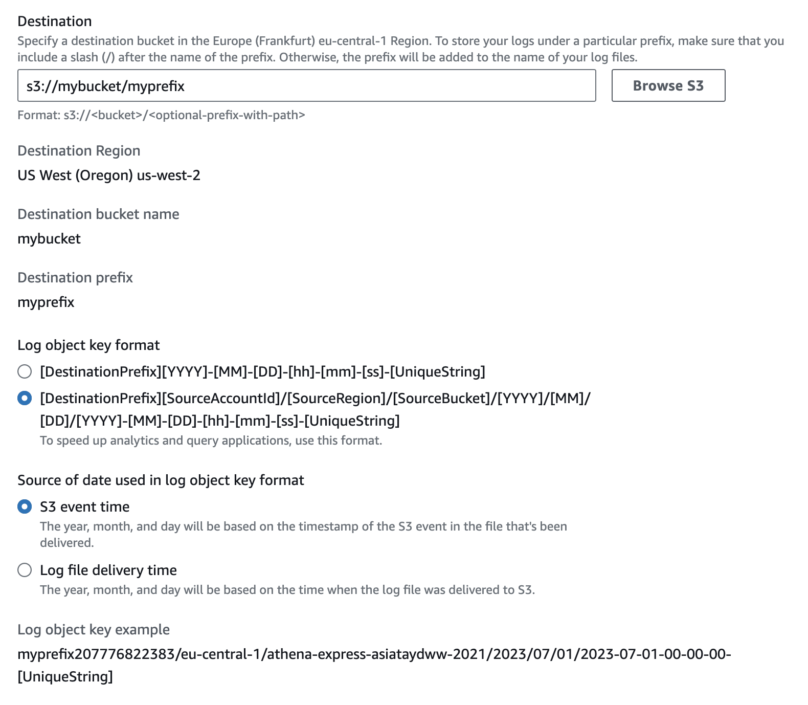

Amazon S3 server access logging now [supports](https://aws.amazon.com/about-aws/whats-new/2023/11/amazon-s3-server-access-logging-date-partitioning/) automatic date-based partitioning for log delivery. This allows services like Amazon Athena to improve performance and reduce cost when querying logs.

### How to enable log delivery with date-based partitioning?

1. Go to the Properties tab of the source bucket: 
2. Find the section for server access logging: 
3. Specify the target bucket and prefix where you want to store the logs and set log object key format to the second option. 


You can find more details here: [How do I enable log delivery?](https://docs.aws.amazon.com/AmazonS3/latest/userguide/ServerLogs.html#server-access-logging-overview)

### How to query partitioned s3 access logs using Athena?
I've created terraform module that creates an AWS Glue table designed specifically to query Amazon S3 server access logs in the new [date-based partitioning](https://aws.amazon.com/about-aws/whats-new/2023/11/amazon-s3-server-access-logging-date-partitioning/) format.
Simply specify the bucket name and prefix where the logs are stored and the module will create a table:    
```hcl
module "s3_access_logs_glue_table" {
  source = "./modules/s3-access-logs-glue-table"

  name          = "s3_access_logs"
  database_name = aws_glue_catalog_database.s3_access_logs_db.name
  location      = "s3://my-logs-bucket/my-logs-prefix"
}
```
After that you can query the table using Athena:
```sql
SELECT *
FROM 
    s3_access_logs
WHERE
    accountid = '111111111111'
    and bucket = 'my-bucket' // name of the bucket for which you enabled logging
    and region = 'eu-central-1' // region where the bucket is located
    and year = '2023'
    and month = '11'
    and day = '25'
```
This way Athena will only scan the logs for the specified date and will not incur any additional cost for scanning the entire log bucket (as it happens by default).

If you have any questions or suggestions, feel free to leave a comment below or contact me on [Twitter](https://twitter.com/alexanderbelet1).

# TODO:
- [ ] Add link to the terraform module
- [ ] Update link to the terraform module in tf.hcl after module published to the registry
- [ ] obfuscate some info in images
- [ ] add selection / poiters to images