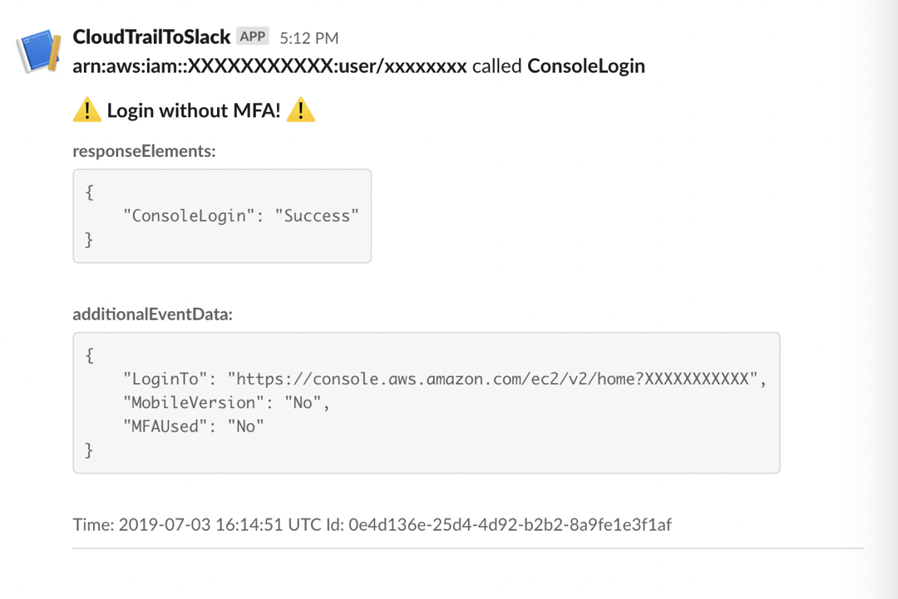

Don’t have enough resources to set up a security department but want to stay on top of your AWS CloudTrail events? Find out how the CloudTrail-to-Slack Terraform module by FivexL solves this problem for startups and small teams. 
## Terraform Module for AWS CloudTrail — An Effective Security Tool 
While large corporations have their own Security Operations Centers (SOCs) responsible for information security and can afford expensive solutions, startups usually don’t have enough resources and time to set up such a luxury. Therefore, they have to look for simple security solutions to protect their data. Understanding the pain of limited resources, FivexL developed the Cloudtrail-to-Slack Terraform Module.

The module works with data gathered from AWS CloudTrail and sends notifications to Slack to keep you updated on what is happening in CloudTrail practically in real-time. Think of it as a surveillance camera that is not constantly monitored but notifies you if something suspicious happens — for example, if a stranger keeps moving near your front or back door.
## What Is AWS CloudTrail?
Let’s briefly discuss AWS CloudTrail. AWS CloudTrail is an AWS service that helps you enable governance, compliance, and operational and risk auditing of your AWS account. Actions taken by a user, role, or an AWS service are recorded as events in CloudTrail. Events include actions taken in the AWS Management Console, AWS Command Line Interface, and AWS SDKs and APIs. More info: What is CloudTrail?

Visibility into this type of data is a key element of corporate security, as you can identify who did what, when, where, and how, as well as what resources were used. As a result, you can always stay on top of what is happening in your Amazon Console to fix misconfigurations timely and prevent intrusions. On the one hand, you have all the data to ensure your security, on the other hand, you are still an easy target for cybercriminals. Here are some reasons why: 
### Too Many Events to Keep Track of Manually 
You can set up notifications from CloudWatch that will send alerts to your email if some suspicious events are recorded. But be ready to devote a lot of time and effort to set them up and comprehend them. 
## Stay on Top of Your CloudTrail Events Easily With CloudTrail-to-Slack Terraform Module 
Sending notifications about AWS CloudTrail events to Slack is a useful feature for startups implemented in the Cloudtrail-to-Slack Terraform module by FivexL. We have built a Python-based Lambda that analyzes all the recorded events in CloudTrails and sends notifications to Slack if they’re categorized as suspicious logs according to rules. Delivering Lamda to AWS is already a solved problem and we decided to use the open source module from [Terraform AWS Modules](https://registry.terraform.io/modules/terraform-aws-modules/lambda/aws/latest). So, this is a ready-made flexible CloudTrail-to-Slack Terraform module. You need only to set it up in a couple of seconds, and the following alerts will be sent to your Slack channel: 
* Activities done by a root account
* Failed API calls, and suspicious
* Console logins without MFA
* Sensitive events like IAM, network, and data storage access changes 
  
As a result, you are always aware if something odd is going on in your AWS Console without investing extra time and effort. Chief Cloud Economist at The Duckbill Group, Corey Quinn, who helps companies decrease their AWS bills, mentioned the module in [his podcast dedicated to security awareness training](https://www.lastweekinaws.com/podcast/aws-morning-brief/security-awareness-training-in-five-minutes/): ‘I found a Terraform module that [deploys Lambda](https://github.com/fivexl/Terraform-aws-CloudTrail-to-Slack) to watch CloudTrail and report to Slack - got all that? Good lord - whenever certain things happen. Those things include root logins, console logins without MFA, API calls that failed due to lack of permissions, and more. This might get noisy, but I’d consider deploying at least the big important ones’. This makes the module worth paying attention to.

Please, note: there is an approximate 5-10 minutes alert delivery delay because the current version is built upon parsing of S3 notifications. 
## CloudTrail-to-Slack Terraform Module Features 
Besides allowing startups to stay on top of CloudTrail events, the Terraform module grants startups flexibility. Here are the main benefits:

### Adjustable Ready-Made Rules 
Startups are known to have little to no time because of limited human resources. To facilitate module setup, there is a set of default rules; they are Python strings that are evaluated during the runtime and designed to return the bool value. The CloudTrail event is flattened prior to processing and should be referenced as an event variable.

Rules can also be ignored. In this case, an event is ignored by Lambda, and no notification is sent to Slack. “Ignore rules” has the same syntax as default ones. But it is highly recommended to fix alerts instead of ignoring them. This approach should be implemented only when there is no opportunity to fix the alert. Here is how you can do this. 
