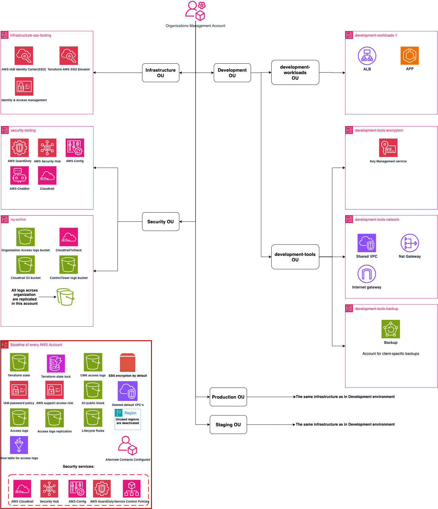



Clearway Health aimed to leverage the full power of AWS to ensure their SaaS solution was built on a robust, scalable and secure infrastructure. They opted to partner with an expert in the space to accelerate their success and chose to use AWS RightStart by FivexL to build their infrastructure.   
     
While creating the first AWS accounts and deploying the first application is relatively straightforward, scaling AWS infrastructure to handle increased traffic, adapt to rapidly evolving market changes, and meet highly complex compliance requirements in the healthcare and specialty pharmacy setting is much more challenging.   
     
"We understood that in order to deliver the results we promise to our clients and to transform specialty pharmacy through our SaaS solution, we needed an expertly crafted AWS environment. It had to seamlessly scale, adapt to our evolving needs, meet compliance requirements, and provide robust security for our data from day zero", said Rusty Atkinson, VP, Technology at Clearway Health.
Recognizing this need, they turned to FivexL, known for helping their clients build infrastructure on AWS.


 


FivexL created a dedicated service called RightStart for AWS for requests like these. The team has packed years of experience into this service, anticipating and addressing the challenges they face at each stage of growth to set them up for success.
  
FivexL's RightStart for AWS leverages the concept of an AWS Landing Zone, which includes a set of best practices and configurations to provide a robust, scalable and secure multi-account AWS environment.  
  
Clearway Health received an infrastructure capable of supporting thousands of future users. Each foundational element is methodically constructed to ensure security and elasticity, providing a solid base that will be sufficient for years to come.
### Key Components Clearway Health received 
**Account Baseline Factory**  
This baseline setup is a key part of FivexL's RightStart for AWS, which allows Clearway Health to maintain a secure and compliant environment without the overhead of configuring each account individually. All accounts come pre-configured with essential contacts (billing, security, operations) and have unused regions disabled for added protection. Additionally, other preconfigured features simplify the usage of accounts, such as OIDC for CI access, Terraform state management and more. Security tooling is configured organization-wide, including AWS Config, Security Hub, CloudTrail and GuardDuty to ensure comprehensive auditing, security posture management, API call logging and intrusion detection.    

**AWS Organization Management Account**  
FivexL implements Organizational Units (OUs) so Clearway Health can group accounts with similar or related functions to apply common policies, share common resources or provision and manage common resources.  

**Logs Archive Account**
All access and security logs are replicated and stored in an immutable log storage setup, ensuring they cannot be altered or deleted, and no one has access to this account by default. This is important for companies like Clearway Health to ensure compliance and maintain a reliable audit trail.


**Security Tooling Account**  
This account features a centralized setup for CloudTrail, Security Hub, Config and GuardDuty, ensuring organization-wide security monitoring and alerting. This centralized security management helps Clearway Health quickly detect and respond to potential threats across their entire AWS environment.    

**SSO Account**  
AWS IAM Identity Center (SSO) is configured with an IDP provider, predefined permission sets and Slack integration for temporary access, ensuring secure and efficient identity management. This setup simplifies access management ensuring that developers of the startup have the right level of access.

**Network Management Account**  
Shared VPC configurations are managed with public, private and database subnets, enhancing security and segregation of workloads. 

**Encryption  Account**  
Multi-regional AWS KMS keys are created and set up in this dedicated account for centralized management. This ensures that the keys are managed by a dedicated team and are not accidentally deleted or modified. Restrictive key policies are implemented to prevent unauthorized modifications. 

**Backup Account**  
Clearway Health received pre-created backup accounts in production, development and staging environments. This setup will help protect their data against loss and ensure business continuity when it becomes necessary.

**Workload Accounts**  
These accounts are ready to accept workloads with ECS clusters and supporting resources pre-configured for different components (e.g., frontend, backend) based on the software architecture. It allows Clearway Health to deploy their applications quickly and efficiently, focusing on growth and innovation.  
  
**Explore FivexL's RightStart for AWS on [AWS Marketplace](https://aws.amazon.com/marketplace/pp/prodview-d4lown4cemykw)**

 







By implementing these components, FivexL’s RightStart for AWS provides a comprehensive AWS Landing Zone that is secure, scalable and compliant. It might sound like a lot of work, but not getting it right from the beginning will cause even more work down the line and hinder or completely stop the product's scalability. Redoing it later can become very complicated and costly.   
   

<h3> Key Benefits of FivexL's RightStart for AWS </h3> 

- Rapid Deployment: Infrastructure set up in just a few weeks, saving months of effort.    
- Scalability: Supports thousands of users, ensuring smooth company growth.    
- Data Protection: Security from day one, protecting sensitive data.    
- Cost Efficiency: Effective management to avoid unexpected expenses.    
- Compliance: Meets regulatory requirements, ensuring clients' trust and reliability.   
   
This setup typically takes a solo in-house specialist over a year to complete, but with FivexL expertise and automation, it was delivered to Clearway Health in just a couple of weeks. The partnership with FivexL equipped Clearway Health tosave time, avoid mistakes, reduce costs and ensure no costly rework later in the process. 
  
Clearway Health delivers specialty pharmacy services that are powered by technology. Their SaaS solution is  proprietary, robust, scalable and secure, - ensuring their ability to deliver ongoing development and rapid scalability in a secure way for their hospital and health system clients and the patients they serve. 


