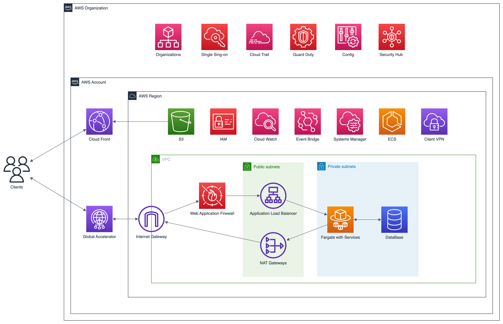



“It was really hard to find a partner with expertise in both cloud and security, combined with the agility to meet our infrastructure needs,”recalls Firi’s CEO Thuc Tuan Hoang. Scaling that infrastructure proved difficult when traffic began to increase exponentially as the business grew with 48,000 customers onboarded in March 2021. “It takes time to rebuild infrastructure and migrate it,” notes Tuan Hoang. “I knew the approach we needed to take but we didn’t have that time or the in-house skills to deliver that change.” 
   
As a rapidly growing startup, Firi faced three key challenges. The business needed to break free from its single point of error, a manual approach where everything had to go through Tuan Hong – bill pipelines, deployment, infrastructure set up... Meanwhile, time was of the essence – Firi needed dedicated support from a proven source. Thirdly, being able to trust a partner to deliver that support, without fail, was vital.  
  



Supported by FivexL, Firi was able to transition from a fragile, manually configured EC2-based setup to a platform - like solution based on the AWS Elastic Container Service. “We moved from only one person being able to deploy to having a governance team ready to deploy, which makes it so much easier for our developers,” says Tuan Hoang of an architecture that had grown way too fast for the Firi team to be able to manage by themselves.  
Now, thanks to an infrastructure-as-code approach, developers are able to use infrastructure templates and rapidly develop and set up new services, enabling Firi to quickly iterate and innovate.


Following two weeks of planning, FivexL was able to hot swap Firi’s infrastructure without downtime by using Terraform, Hashicorp’s infrastructure-as-code tool. “It was an essential approach for us to be able to scale moving forward,” says Firi’s CEO. “FivexL’s AWS expertise meant the migration process was a smooth one with the first application deployed in just two weeks.”  







{{< case_study/benefits
    cta_text="Start Your Success Story"
    cta_url="https://sales.fivexl.io/schedule-a-call"
    image="benefits_firi.png"
    blockquote=`FivexL have given us the peace of mind to plan for the future as we aim to expand outside Norway across the Nordics

Firi's platform will be focused on building more around payments so security will play a much larger role as we make upgrades on the database to improve our ability to handle trades in miliseconds.

It's been such an impressive feat to get where we are, with FivexL's involvement it has opened up a whole new world for the business.`
    blockquote_author="Tuan Hoang CEO at Firi"
    >}}

“The change was seamless,” recalls Tuan Hoang of a process carried out with pain-free predictability. “Everything just worked... There were no hidden surprises and it was reassuring to know we had support whenever we needed it. FivexL helped us develop better credential management, tune our security groups and IAM policies, improving the security of the whole system. It wasn’t just a single job but a holistic approach to infrastructure that will deliver lasting benefits. Our new CTO was really impressed with the solutions FivexL implemented. We got way more than we asked for.”    
The speed with which FivexL was able to update the infrastructure allowed Firi to deliver its latest changes as quickly as possible without the risk of application downtime; this gave its team the flexibility to scale in line with the increasing volume of traffic during a year that saw the startup grow to employ 50 full time staff. “We needed a partner who could go on that journey with us, find the weak spots of our software management and help us improve,” says Tuan Hoang.  
“They give us the same level of support we offer to our own customers and have allowed us to maximise the efficiency of our approach to Amazon’s services instead of just throwing money at the issue.”  
  

