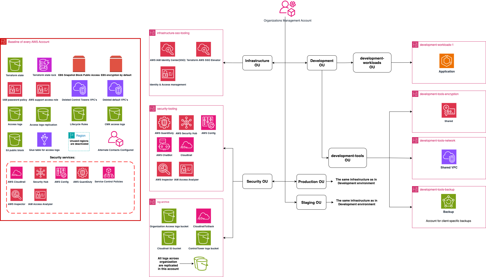



In the early stages of company development, Hippo began collaborating with FivexL to establish HIPAA-compliant AWS infrastructure to support the development of a minimum viable product (MVP). The company operates in a highly regulated space, handling sensitive health data that must comply with strict US legal and technical requirements. 
   
As Mattias Hemmingsson, Head of Security at Hippo, explained:  
 “We’re handling ePHI, which is medical personal information—like what drugs a person is taking, their name, and that kind of thing. So that’s very restricted in terms of how it can be handled. The US has a law called HIPAA, which defines those restrictions—what you can and can’t do. You have to follow these restrictions before you can transfer any PHI data. These rules apply not just internally, but also when working with customers and external partners.” 
   
As the company pivoted and eventually gained traction, it began onboarding integration partnersand each of those partners required passing a security audit. The logical next step was to initiate SOC2 certification to streamline future audits, attract more partners and support business growth. While the infrastructure had evolved well, preparing for SOC2 revealed several compliance gaps. Addressing them required significant effort under a tight deadline. 

  



### FivexL´s RightStart for AWS 
FivexL provided its productized service, RightStart for AWS—a Control Tower-based Landing Zone—to address these evolving compliance and scaling needs. FivexL’s RightStart is a compilation of best practices and accumulated experience from numerous projects implemented as Terraform templates. It could be deployed to new or existing AWS Organizations in a matter of weeks, allowing for quickly improved infrastructure alignment with regulatory requirements and getting it ready for compliance certification as SOC2 or a security audit.  

RightStart for AWS equips clients with a compliance-ready infrastructure that, while secure, still facilitates rapid development and iteration. This setup includes AFT-based account vending automation, simplifying the provisioning of new accounts with a safe and compliant baseline while enabling the reuse of shared services, such as networking and log aggregation, thus reducing costs and offering granular control.  
This service was designed to streamline the infrastructure upgrade process, ensuring Hippo’s platform was well-prepared for regulatory compliance and production-level demands.  

With FivexL’s RightStart for AWS, Hippo gained several core benefits.  
 
**Dedicated Accounts with Multi-Account Strategy**  
Thanks to the collaboration with FivexL from the start, Hippo had already adopted a Multi-Account AWS Strategy (watch the video "Why Use Multiple AWS Accounts?"). This approach allowed them to separate different environments and workloads for better management and security. 
As a result, the startup received a well-organized structure with accounts arranged by organizational units,  including accounts for workloads, tools, shared networking, observability, and encryption services.  
Mattias Hemmingsson, Head of Security at Hippo, noted:
“This setup makes life really simple from a compliance perspective—because I can clearly show: ‘This is the account where we have the sensitive data, and you can see it’s really locked down.’ That’s a key factor. The segmentation of the network, how accounts are set up, and the structure—it’s super helpful for compliance.”
  
**Centralized Organization Management with Control Tower**  
AWS RightStart by FivexL enabled Hippo to go further by providing centralized control over all accounts within the organization. With Control Tower, changes are not deployed individually to each account. Any modifications are automatically delivered across all accounts, ensuring consistency and saving time. It also included automating security tooling and configurations provided by AWS, enhancing Hippo's infrastructure's overall security and compliance.   
  

  
**Enhanced Security with Centralized Security Toolsy**  
With FivexL’s RightStart for AWS, Hippo received a dedicated Security Tooling Account to manage essential tools like CloudTrail, Security Hub, Config, and GuardDuty across the organization. This centralized setup facilitated monitoring and rapid response to potential threats, providing the startup with strong protection for its AWS environment.  
FivexL included its open-source tool, SSO Elevator for AWS ([watch the video](https://youtu.be/CrIfaNpuCeY?feature=shared)), in the RightStart package. This tool offers temporary elevated access through the AWS IAM Identity Center (the successor to AWS Single Sign-On) and Slack. This arrangement simplified IAM access planning and management while ensuring smooth audits.  
“SSO Elevator is another really valuable part—access is granted only for a limited time and combined with account segmentation. So the access is specific, not broad. That’s been really helpful for our compliance work,” said Mattias Hemmingsson, Head of Security at Hippo. 

**Effective Cost Management**  
RightStart for AWS, developed by FivexL, includes features like cost anomaly detection, which alerts the team if spending trends exceed predefined thresholds via email and AWS Chatbot. Using shared configurations, such as network and encryption, reduces the overall resources, leading to significant cost savings.  

**Implementation Process**
While building infrastructure from scratch with FivexL’s RightStart for AWS is the fastest process, migrating existing infrastructure to RightStart requires some extra preparation. Hippo's existing infrastructure was already defined as code using Terraform, which made the transition to the new configuration simpler. The previous state was exported and compared with the setup used in FivexL's test organization. The FivexL team prepared code to migrate to the new resources while retaining critical resources, such as S3 buckets, which are better transferred rather than recreated. As a result, FivexL helped Hippo seamlessly migrate the existing organization to the new configuration. 







{{< case_study/benefits
    cta_text="Start Your Success Story"
    cta_url="https://sales.fivexl.io/schedule-a-call"
    image="goto_benefits.png"
    blockquote=`I think FivexL did a really good job of being deliberate, explicit, and highly consistent about the work. From day one, I knew exactly what the goals were, what the scope was, and what to expect — everything was clearly listed and communicated multiple times. And all of it was delivered.  
    
    Every morning I’d check our Slack channel and see what was done, what’s next, and what I needed to do. It couldn’t have been easier to interact with FivexL. They were extremely responsive, especially during the critical period leading up to launch. That support made a real difference for us`
    blockquote_author="Nate Sesti, CTO at Continue"
    >}}

By combining FivexL’s RightStart for AWS with a production-ready ECS setup, the Continue team was able to launch their paid product confidently — without slowing down development or compromising security.   
Anton, FivexL’s consultant on the project, said:
“The best moment for me was getting a message from the client — during the product launch, everything infrastructure-related went smoothly and perfectly.¨  
  
That smooth launch was just the start, the infrastructure built through this collaboration continues to deliver long-term value across several areas.
 
<b>Built for global growth</b>  
The infrastructure was designed to scale across regions, with AWS Global Accelerator ensuring fast, reliable performance worldwide — a strong foundation for global scaling.  
 
<b>Ready to scale, fast</b>   
FivexL’s RightStart includes an account factory for Terraform, making it easy to launch new environments or isolated setups for enterprise clients — all fully automated. 
 
<b>Secure by design</b>   
FivexL’s RightStart for AWS comes with encryption, access controls, centralized logging, and alerting built in. It reduces risk from the start and supports audit readiness for SOC 2 and other compliances.  
 
<b>Infrastructure they can own</b>  
The Continue team now has a clear, modular setup they can manage and extend independently — using the same Terraform modules FivexL provided. They also received full documentation covering how everything works, making it easier to onboard new team members and evolve the system over time.  
 
<b>Transparent delivery process</b>  
FivexL delivered the full RightStart for AWS setup in about three weeks. ECS configuration and workload integration followed, with daily Slack updates and regular demos keeping the team in sync throughout the project.  
  
  

