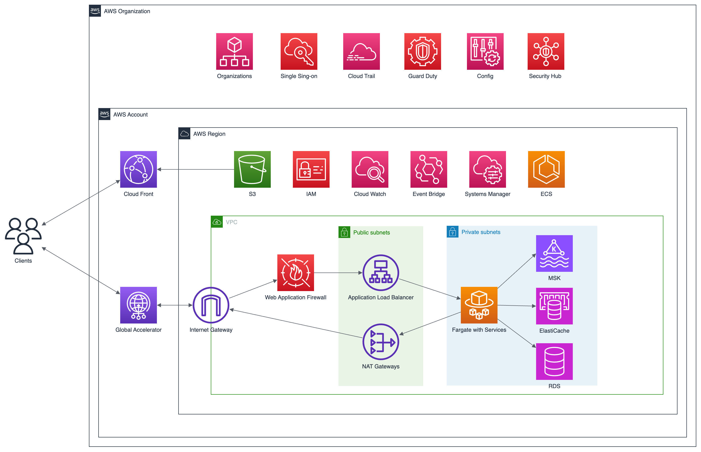



Kosli began their journey by building infrastructure using Google Cloud and Kubernetes. At the outset, Google Cloud was a practical platform for launching their Minimum Viable Product (MVP) into the market. Mike Long, CEO of Kosli, says, “It was fine to begin with using Google to get our MVP out there.” As the company expanded its client base, however, their needs evolved. 
 

Kosli made a pivotal decision: migrating from Google Cloud to AWS for a managed document database, which better suited their evolving needs. The decision to opt for AWS, particularly for its superior DocumentDB, was a strategic one. Mike Long, CEO of Kosli, emphasizes, “We needed a managed, reliable document database, and Amazon’s DocumentDB was the best choice.” 
   

In response to these significant changes and to focus on product development, Kosli sought external expertise for its infrastructure. They partnered with FivexL to guide them through this critical migration. The new priorities were clear: enhancing application availability, ensuring data security, preparing for audits, and aligning with the specific compliance requirements of their diverse clients.
 


 


As Kosli's startup expanded, upgrading their infrastructure became a critical step. The initial phase involved migrating from Google Cloud to AWS.  
    

FivexL's years of experience working with startups using AWS enable it to select the most suitable tools for each company's specific needs from the wide variety of choices AWS offers. For Kosli, FivexL utilized a particular combination of specialized AWS services chosen for their specific business requirements, coupled with the FivexL gold standard—a series of best practices.   
   

**Migration from Google Cloud to AWS**  
Artem Zhelezov prepared the infrastructure for Kosli's seamless migration from Google Cloud to AWS and helped the startup switch from Google Kubernetes Engine to AWS managed services - Elastic Container Service (ECS) with Fargate serverless compute provider.   
   

This transition helped to improve the application security and reduce operational costs since it no longer needs to manage Kubernetes resources, maintain virtual machines, and perform compute platform updates. Shifting the operational burden to AWS unloaded the team to focus on product development.  
   

The next step was transitioning from EBS, which the application used to store the data to DocumentDB. Before this, data was written directly to disk, significantly slowing the application. Migrating to DocumentDB improved app performance and availability.  
   

**Audits and recovery plan**   
Artem Zhelezov assisted Kosli in successfully passing the audit, an important step in the company's evolution. From the infrastructure perspective, Kosli needed a disaster recovery plan to meet the audit requirements.   
   

Artem developed the plan and modified Terraform specifications to implement it in another region. According to the disaster recovery plan, if the application's current region goes down entirely, Kosli can fully recreate the infrastructure and restore all managed data in another region within a few hours.  
   



**AWS Right Start**   
Over years of experience building AWS infrastructure for startups, FivexL collected a set of best practices for creating secure and compliance-ready multi-account AWS organizations. These practices are universally applied across all of FivexL’s projects. They are essential for any startup looking to begin their AWS journey on the right foot, especially those focusing on security and aiming to scale quickly. The consistent application of these practices across various projects led to the development of what FivexL now calls 'AWS Right Start':

**- Multi-Account Strategy**   
FivexL implemented a multi-account strategy, separating different environments into distinct AWS accounts. This strategy involves setting up separate AWS accounts for various operational areas, such as development, production, testing, access organization, monitoring, etc. Each account is customized to meet specific needs, ensuring a clear separation of resources and roles. This enhances security, streamlines cost management, and boosts operational efficiency. Additionally, this approach simplifies compliance and auditing processes. 

**- Efficient Management** 
Artem Zhelezov configured the AWS management account to send budget and cost anomaly detection alerts to Slack. This setup is designed to identify unintended spending and promptly prevent unexpected billing issues.

**- Enhanced Security** 
Mike Long, CEO of Kosli, says, "Our customers are extremely sensitive to security and data privacy. They have standards and expectations, and we knew that those expectations would grow over time. So, we wanted to ensure that we built everything with security as the basis."   
To bolster security, minimize human error in credential management, and ensure smooth sailing through audits, Artem established a smart access organization to AWS resources. This was achieved using AWS SSO Elevator,  FivexL’s open-source tool, which implements temporary elevated access via AWS IAM Identity Center (Successor to AWS Single Sign-On) and Slack. 
   
  

 







The new high-performing and secure infrastructure, defined as code, enabled Kosli to scale its business effectively. FivexL built an infrastructure that met their audience's needs and ensured compliance, enhancing security. FivexL developed a disaster recovery plan and helped Kosli pass audits.   
 
Performance issues were resolved, significantly speeding up the application. By migrating to AWS and utilizing DocumentDB, Kosli saw improved application performance and availability. As Mike Long, CEO of Kosli, highlights, "FivexL has been a partner in our journey. So it was helping us transition to AWS and also helping us maintain, evolve, grow, and improve our systems over time."   
 
Beyond core tasks, FivexL provided educational support through code reviews, demo meetings, and daily status updates. This kept Kosli's team informed about infrastructure changes, ensuring everything was under control and fostering confidence in their system's stability and compliance.  
 
Artem Zhelezov documented all his actions, giving Kosli a comprehensive history of changes. This approach ensures that Kosli is independent of FivexL: anyone who joins the team in the future can understand how everything operates. 
 
Looking ahead, Kosli plans to expand their business into new regions. They aim to continue collaborating with FivexL, which will support their growth goals and ensure ongoing success.
 
 



