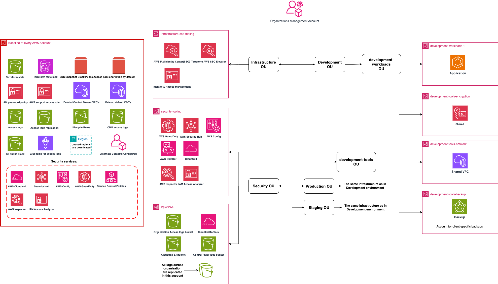



When Neverless decided to expand beyond Google Cloud, this wasn't an experiment. The goal was to run AWS in production and steadily move a major part of the platform there — without slowing releases or opening security gaps. 
 
They needed an AWS footprint to get closer to the ecosystem they depend on. In crypto, many exchanges and core industry services have historically lived in AWS, and that gravity field matters: latency, connectivity patterns, and even day-to-day operational expectations shift when most counterparties are "AWS-first." 
 
The catch: Neverless had a strong Google Cloud setup, but not deep AWS expertise in-house — and no time for a slow learning curve. Building the basics the right way (accounts, networking, identity, security guardrails, and a deployment-ready baseline) would take time they didn't have. Building them the wrong way would lock in costly debt at the foundation layer. 
 
They came to FivexL with a clear task: set up the AWS foundation quickly and safely, so the team could extend the AWS side immediately — while keeping Google Cloud running and leaving room for a future shift of ~70% of the platform to AWS.




Neverless needed AWS running in production without slowing delivery. FivexL focused on the AWS foundation (accounts, governance, identity, security, and cost controls). Workload migration was handled by the Neverless team, with guidance where needed. 
 
FivexL delivered <a href="/rightstart">RightStart for AWS</a> — a productized service which provides the organization and security foundation so the team could build and migrate workloads on top at their own pace. 
 
<strong>RightStart for AWS</strong> gave Neverless a secure, scalable AWS foundation that could be rolled out quickly, without creating rework later. RightStart is a ready-to-deploy AWS foundation built on AWS Control Tower. It sets up a secure, multi-account AWS Organization using proven best practices and Terraform templates, improving alignment with regulatory requirements and preparing the environment for compliance certification such as SOC 2 or a security audit. 
 
<strong>Dedicated Accounts with Multi-Account Strategy</strong> 
Neverless adopted a Multi-Account AWS Strategy. This approach separates environments and workloads into different AWS accounts, which improves security and makes operations easier to manage. As a result, Neverless received a clear, well-organized structure with accounts grouped by organizational units — including dedicated accounts for workloads, tools, shared networking, observability, and encryption services.


<strong>Centralized Organization Management with Control Tower</strong> 
FivexL enabled AWS Control Tower in Neverless's primary region and selected a secondary region for governance. This put AWS-managed guardrails and baseline audit logging in place from the start. With Control Tower and AFT (Account Factory for Terraform), Neverless gained centralized control over all AWS accounts in the organization. 
 
<strong>Enhanced Security with Centralized Security Tools</strong> 
Neverless received a dedicated Security Tooling Account to manage essential tools like CloudTrail, Security Hub, Config, and GuardDuty across the organization. FivexL included its open-source tool <a href="https://github.com/fivexl/terraform-aws-sso-elevator">SSO Elevator for AWS</a> in the RightStart package, offering temporary elevated access through AWS IAM Identity Center and Slack. 
 
<strong>Effective Cost Management</strong> 
RightStart includes features like cost anomaly detection, which alerts the team if spending trends exceed predefined thresholds via email and AWS Chatbot. Using shared configurations, such as network and encryption, reduces the overall resources, leading to significant cost savings.





The work was delivered in clear stages, and each major stage ended with a customer demo to show what was already working, confirm outcomes, and align on next steps. 
 
<strong>Stage 0: Project kickoff</strong> 
Aligned on essentials: where the AWS setup will live, who owns what, and what inputs needed from the customer. 
 
<strong>Stage 1: Secure access</strong> 
Set up safe, controlled access to the new AWS environment. You need a secure "front door" before anything else. 
 
<strong>Stage 2: Remove scaling blockers</strong> 
Removed typical AWS account limits and support blockers that can stop a new setup from scaling. 
 
<strong>Stage 3: Set the cloud foundation</strong> 
Created a governed AWS foundation that acts like the "operating system" for the company's cloud.


<strong>Stage 4: Make access simple and auditable</strong> 
Connected AWS access to the company's existing identity system, keeping access simple to manage and easy to audit. 
 
<strong>Stage 5: Automate the setup</strong> 
Put the foundation under automation for consistent, repeatable deployments. This removes manual work and prevents mistakes. 
 
<strong>Stage 6: Apply security/logging/cost defaults</strong> 
Applied the standard baseline across the AWS setup: security, logging, and cost visibility from day one. 
 
<strong>Stage 7: Prepare environments + handover</strong> 
Prepared core environments (dev, staging, production) and connected operational workflows. Handed over walkthroughs and documentation so teams can start building immediately.









<strong>Enabled AWS production use while keeping Google Cloud running</strong> — reducing migration risk and avoiding downtime during expansion. 
 
<strong>Immediate outcomes (first month)</strong> 
Neverless got what they came for: RightStart delivered as an AWS organization and security foundation, without slowing down their product work. One of the strongest signals of real adoption was how quickly they used disciplined access patterns — they were among the few customers who started using SSO Elevator for production access right after deployment. 
 
<strong>Longer-term outcomes (2–6 months)</strong> 
Neverless can expand the AWS side while keeping GCP running, and continue workload migration on their own on top of a foundation they won't need to rebuild later. That baseline reduces the risk of having to redo core platform pieces like networking, and it simplifies audit work because the structure and controls exist from day one. 
 
They also secured additional AWS credits, giving them a longer runway to build on AWS with significantly less infrastructure cost pressure.

