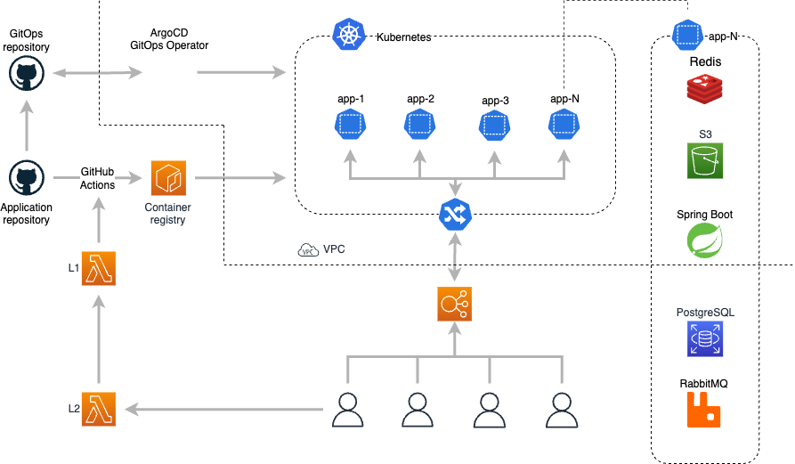



The ultimate challenge was to promptly launch a Cloud version of Qameta’s on-prem solution – Allure TestOps – with scalability and security requirements in mind. It all started with an MVP and then transformed into a fully-fledged product.  
  
This project was prompted by Qameta user's requests for a cloud version of the successful on-prem Allure TestOps software. Thus Qameta team started to investigate a possibility to launch a SaaS MVP based on the existing software and test economic models of the possible offering. Artem Eroshenko, co-founder and CPO at Qameta Software, recalls: “Launching a cloud solution required expertise our startup lacked at that time.” This was when Qameta partnered with FivexL. “We focused on three key criteria when choosing FivexL: team availability and readiness for rapid delivery, flexible and transparent workflows, and adherence to our budget,” noted Artem Eroshenko.    
  
FivexL had to build a SaaS infrastructure for the on-prem solution and create SaaS client environments in a click. To address the needs of a rapidly developing startup, the infrastructure had to be secure, scalable, and require minimum maintenance.  

 


Qameta received Allure TestOps Cloud – an architected solution based on the on-prem Allure TestOps software – in time. To minimize in-house development, therefore, further maintenance, FivexL used as many ready-to-use components and managed services as possible. Artem Eroshenko said: “By developing infrastructure, FivexL allowed us to focus on our core business: product development, hypothesis testing, feedback collection from real users, and roadmap generation.”  
FivexL engaged in the project two of its AWS Solutions Architects. Firstly, Ivan Razzhivin built an MVP and Serverless API that allowed it to launch environments with a single click. To create and control specific client resources in a cloud provider from the EKS cluster, Crossplane (dynamic resources controller) and ArgoCD were used. As a result, Allure TestOps evolved from Kubernetes helm charts to a cloud-based SaaS offering.   
After Stage 1, Qameta released a Beta-version to test it on real users.
The prototype functioned well and was in demand, which led to Stage 2 – a full-fledged product launch. FivexL involved a second consultant – Alexey Eremin – who integrated monitoring features to prevent possible incidents with a massive flow of users.


He incorporated an alerting stack in AWS Managed Grafana, Betteruptime, Prometheus, and Cloud Watch and created a new, improved API version to manage client environments.  
As with many small teams, Qameta aimed to control prices and optimize budget allocation. The startup Co-Founder recalls: “We valued flexibility, cost-controlled cloud services to meet the MVP testing budget and the self-sufficiency of vendors.”  
To adhere to the budget limits, FivexL implemented an elastic and robust configuration that allowed to leverage shared resources to maximize agility and minimize costs. As a result, the client’s costs decreased by 40%, which is cheaper compared to Digital Ocean compute offerings.  
FivexL transferred knowledge and best practices on the implemented AWS infrastructure to Qameta’s engineer.  
    
[Qameta launched](https://qameta.io/blog/allure-testops-cloud-is-generally-available-to-all-dev-teams/) a fully-fledged solution in July 2022. Many clients waited in line to use the Allure TestOps Cloud.   
It was a major success! The number of clients grew rapidly.
 
 







“FivexL heavily supported us in launching a Cloud Allure TestOps version. Self-sufficiency, a deep understanding of our needs, a result-oriented approach, and the delivery of a working solution within a short timeframe – all these factors make FivexL a team of professionals”, says Artem Eroshenko, co-founder and CPO at Qameta Software. 
     
The product is easy to maintain, scale, and develop thanks to the infrastructure implemented as a code. This also allows Terraform specifications to be used as documentation and facilitates knowledge transfer across the team. Aligned teamwork allowed Qameta to launch a performant MVP that delivers on time. 
   
“After a successful MVP launch, FivexL and us continued providing maintenance and optimizing cloud services” recalls the Qameta Co-founder Artem Eroshenko. 


